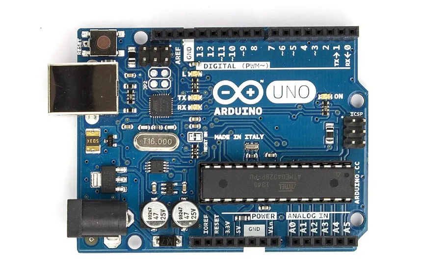
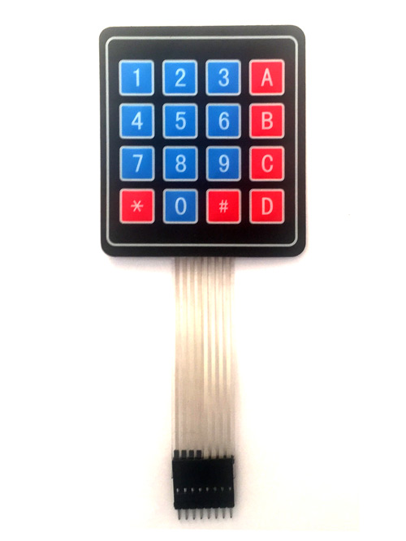
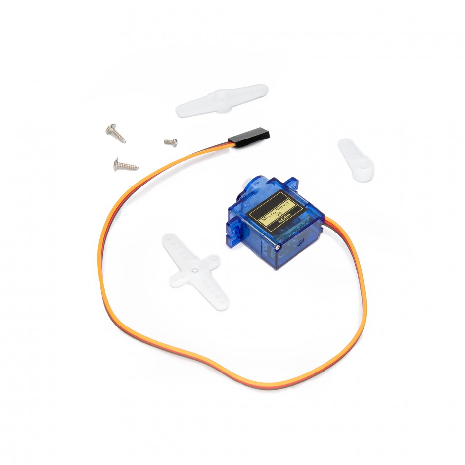
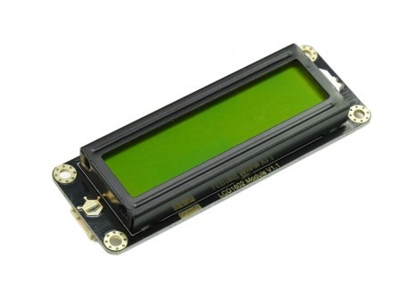
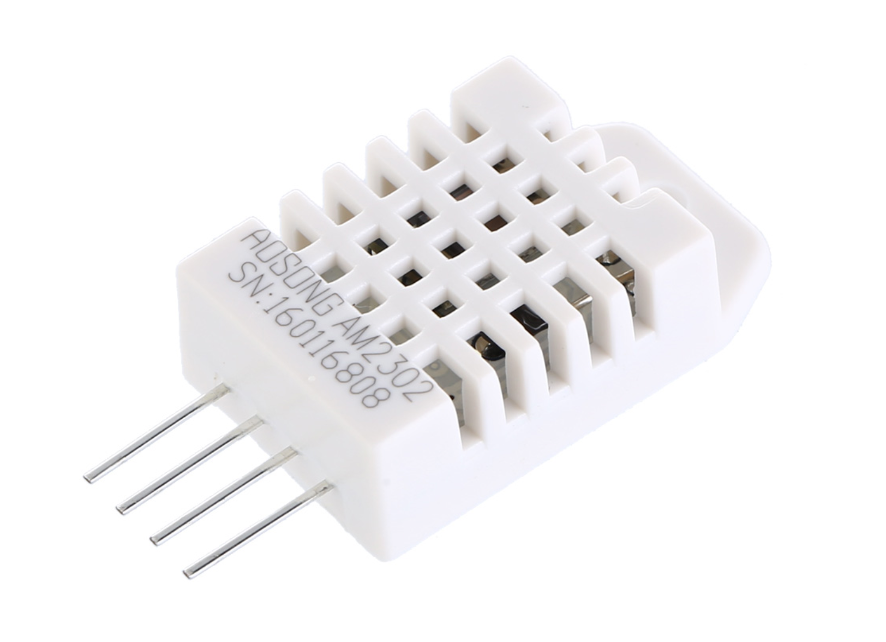

# Ascensor Industrial Inteligente ACME

## Descripción del proyecto

El proyecto consiste en el desarrollo de un sistema de ascensor inteligente implementado sobre una placa Arduino UNO y simulado en la plataforma WOKWI. El sistema ha sido diseñado para simular el funcionamiento de un ascensor industrial automatizado, integrando sensores, actuadores y sistemas de monitorización ambiental.

El ascensor permite la selección de plantas mediante un teclado matricial, gestiona automáticamente el movimiento entre plantas y controla la apertura y cierre de puertas mediante una máquina de estados.

Además, el sistema incorpora funciones de monitorización ambiental mediante sensores de temperatura, humedad y detección de presencia, mejorando la eficiencia energética y el confort de los usuarios.

---

## Características principales

- Selección de plantas mediante teclado matricial.
- Simulación del movimiento del ascensor mediante servomotor.
- Sistema de apertura y cierre automático de puertas.
- Indicadores visuales mediante LEDs NeoPixel.
- Conteo de personas mediante pulsadores.
- Detección de sobrecarga con alarma acústica.
- Monitorización de temperatura y humedad mediante sensor DHT22.
- Activación automática de iluminación mediante sensor PIR.
- Control automático de ventilación.
- Visualización de información mediante pantalla LCD I2C.

---

## Componentes utilizados

| Componente | Función |
|---|---|
| Arduino UNO | Control principal del sistema |
| Keypad | Selección de planta por parte del usuario |
| Servomoto | Simulador del movimiento del ascensor |
| LCD 16x2 I2C | Visualización de parámetros |
| Tira de LEDs - NeoPixel | Indicador visual de la posición del ascensor |
| DHT22 | Sensor de temperatura y humedad |
| LEDs | Señalización visual |
| Buzzer | Alarmas acústicas |
| Pulsadores | Simulación de entrada y salidas de personas |
| Sensor PIR | Detección de presencia y activación automática |

---

## Descripción de componentes

### Arduino UNO

Microcontrolador principal encargado de la lectura de sensores, procesamiento de datos y control de actuadores del sistema automatizado. Seleccionado como unidad de control principal, debido a la facilidad de uso, compatibilidad con múltiples sensores y su integración con la plataforma de simulación WOKWI.

[Fuente de la imagen](https://en.wikipedia.org/wiki/Arduino_Uno)

[Datasheet](doc/datasheet/Arduino.pdf)

### Keypad (teclado matricial)

Utilizado para la selección de plantas por parte del usuario. Permite introducir las llamadas del ascensor de forma sencilla.

[Fuente de la imagen](https://components101.com/misc/4x4-keypad-module-pinout-configuration-features-datasheet)

[Datasheet](doc/datasheet/keypad.pdf)
### Servomotor

Empleado para simular el movimiento del ascensor entre plantas mediante diferentes posiciones angulares.

[Fuente de la imagen](https://www.mikroe.com/micro-servo-motor-sg-180-degree)

[Datasheet](doc/datasheet/servomotor.pdf)

### Pantalla LCD 16x2 I2C

Permite visualizar en tiempo real las variables ambientales, estados del sistema y parámetros configurables del ascensor industrial. Usado para la visualización de datos a través de una pantalla. Muestra de forma clara y organizada la información del sistema. El uso del protocolo I2C reduce el número de conexiones necesarias.

[Fuente de la imagen](https://tienda.bricogeek.com/pantallas-lcd/1444-pantalla-lcd-16x2-i2c.html)

[Datasheet](doc/datasheet/LCD.pdf)

### Tira de LEDs (NeoPixel)

Utilizada como indicador visual de la posición del ascensor y de las llamadas pendientes. 

[Fuente de la imagen](https://shop.pimoroni.com/products/flexible-rgb-led-strip-neopixel-ws2812-sk6812-compatible?variant=30260032110675)

[Datasheet](doc/datasheet/neopixel.pdf)
### Sensor DHT22

Sensor digital utilizado para medir temperatura y humedad relativa del entorno de operación. Encargado de medir la temperatura y la humedad dentro del ascensor, permitiendo el control automático del sistema de ventilación. 

[Fuente de la imagen](https://cityos-air.readme.io/docs/4-dht22-digital-temperature-humidity-sensor)

[Datasheet](https://drive.google.com/viewerng/viewer?url=https://cdn-shop.adafruit.com/datasheets/Digital%2Bhumidity%2Band%2Btemperature%2Bsensor%2BAM2302.pdf)

### LEDs de señalización
Indicadores visuales utilizados para representar estados de funcionamiento, alarmas o activación de sistemas auxiliares. Empleados para la iluminación del interior del ascensor y como indicador del sistema de ventilación.

### Buzzer
Actuador acústico utilizado para generar alertas sonoras ante determinadas condiciones del sistema. Implementado como sistema de aviso acústico en caso de sobrecarga de personas en el ascensor.

### Pulsadores
Utilizados para simular la entrada (pulsador izquierdo) y la salida (pulsador derecho) de personas del ascensor, permitiendo llevar un conteo del número de ocupantes.

### Sensor PIR (Infrarrojo pasivo)
Utilizado para detectar movimiento en las proximidades del ascensor, activando la iluminación de forma automática incluso antes de que los usuarios entren. La selección de estos componentes se ha realizado buscando un equilibrio entre simplicidad, funcionalidad y adecuación a los objetivos del sistema.

## Funcionamiento del sistema

El sistema desarrollado simula el funcionamiento de un ascensor inteligente industrial. Los usuarios pueden seleccionar la planta de destino mediante un teclado matricial y el sistema gestiona automáticamente el desplazamiento entre plantas, así como la apertura y cierre de puertas.

El movimiento del ascensor se controla mediante una máquina de estados, permitiendo gestionar de forma organizada los distintos procesos del sistema.

Además, el sistema incorpora monitorización ambiental mediante sensores de temperatura y humedad, activando automáticamente la ventilación cuando se superan determinados umbrales.

También se incluye detección de movimiento mediante un sensor PIR, utilizado para activar la iluminación automáticamente y mejorar la eficiencia energética.

---

## Principales funciones del firmware

| Función | Descripción |
|---|---|
| moverMotor() | Simula el movimiento del ascensor |
| leerKeypad() | Gestiona las llamadas de usuarios |
| siguientePlanta() | Determina la siguiente planta destino |
| moverAscensor() | Implementa la máquina de estados |
| actualizarLEDs() | Gestiona la señalización visual |
| pulsadorPersonas() | Gestiona el conteo de personas |
| controlSobrecarga() | Detecta situaciones de sobreocupación |
| tempYhumedad() | Lee temperatura y humedad |
| datosLCD() | Actualiza la información mostrada |
| controlAmbiente() | Gestiona iluminación y ventilación |

---

## Pruebas realizadas

Se han realizado diferentes pruebas individuales e integradas para validar el correcto funcionamiento del sistema:

- Prueba de movimiento entre plantas.
- Prueba de la máquina de estados.
- Prueba del teclado matricial.
- Prueba del conteo de personas.
- Prueba del sistema de sobrecarga.
- Prueba de visualización en LCD.
- Prueba del sensor DHT22.
- Prueba del sistema de ventilación.
- Prueba del sensor PIR.
- Prueba global del sistema integrado.

Los resultados obtenidos han permitido verificar el correcto funcionamiento y estabilidad del sistema en diferentes escenarios de uso.

---

## Simulación en WOKWI

[Acceso al proyecto en WOKWI](https://wokwi.com/projects/463175469323648001)

---

## Bibliografía y referencias

- Documentación oficial Arduino:
https://www.arduino.cc/

- Plataforma de simulación WOKWI:
https://wokwi.com/

- Documentación Adafruit NeoPixel:
https://learn.adafruit.com/adafruit-neopixel-uberguide

- Material docente de la asignatura Equipos e Instrumentación Electrónica.

- Cameron, A. (2019). Arduino Applied: Comprehensive Projects for Everyday Electronics.

